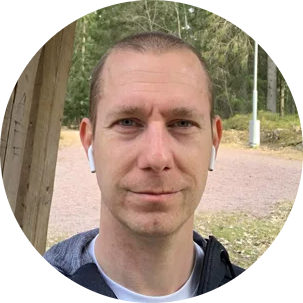

# Västerås Azure User Group

Välkommen till Västerås Azure User Group! Denna user group är till för att samla IT-communityn i Västerås med omnejd, men det spelar ingen roll var du bor, är du intresserad av att göra resan till Västerås är du välkommen! Gruppen drivs av communityn för communityn med målet att leverera ett förstklassigt innehåll där fokus ligger på Azure och Microsoft 365. Gruppen är öppen för alla med ett intresse av Microsoft-teknik, vare sig du är utvecklare, arkitekt, konsult, tekniker, student eller entusiast. Är du intresserad av Azure eller Microsoft 365 är detta platsen för dig!

## Kom på en träff 👩‍💻

Vi siktar på att träffas en gång varannan månad, och vi gör det fysiskt. Vi håller inte till på en fast plats utan mötesplatsen ändras för varje tillfälle beroende på vad vi lyckas få tag i för lokal. Våra träffar är öppna från runt 17-tiden för lite mingel och mat, därefter kör vi 2 presentationer om något Azure- eller M365-relaterat ämne.

Att delta på en träff är helt gratis tack vare våra [sponsorer](./sponsors) som hjälper till att ordna lokaler och tilltugg inför varje träff. Även om våra event är kostnadsfria för dig som deltagare behöver vi ha koll på hur många som kommer så vi vet hur stor lokal vi behöver, samt hur mycket mat som behöver beställas. Vi kör därför med anmälan till varje träff via [Meetup](https://www.meetup.com/vasteras-azure-user-group/){:target="_blank"}.

### Träffar 🗓️

- [Maj - 18/5 -22 - Hotel Plaza (Advania)](https://www.meetup.com/vasteras-azure-user-group/events/285372657/?isFirstPublish=true){:target="_blank"}
  - Strengthen your ARM using Azure Bicep - [Stefan Ivemo](https://twitter.com/StefanIvemo){:target="_blank"}
  - Taking Azure Container Apps for a spin - [Nils Hedström](https://twitter.com/NilsHedstrom){:target="_blank"}
- [Augusti - 24/8 -22 - B26 (Sogeti)](https://www.meetup.com/vasteras-azure-user-group/events/285953578/){:target="_blank"}
  - Sql Server 2022, ett steg närmare molnet - [Magnus Ahlkvist](https://twitter.com/Transmokopter){:target="_blank"}
  - Framtiden är redan här! Hur modern security, AI och machine learning tillämpas i M365 - [Fredrik Thorild](https://twitter.com/taxonomythorild){:target="_blank"}
- [Oktober - 19/10 -22 - Hotel Plaza (Forefront Consulting)](https://www.meetup.com/vasteras-azure-user-group/events/288790984/){:target="_blank"}
  - Windows 365 och varför det är coolt - [Ola Ström](https://twitter.com/olastromcom){:target="_blank"}
  - Azure Networking for developers and other curious creatures - [StefanIvemo](https://twitter.com/StefanIvemo){:target="_blank"}
- [December - 1/12 -22 - Consid Västerås](https://www.meetup.com/vasteras-azure-user-group/events/289480908/){:target="_blank"}
  - Defender for DevOps - Make the west less wild! - [Björn Sundling](https://twitter.com/Bjompen){:target="_blank"}
  - Azure Functions in Action - [Emanuel Palm](https://twitter.com/PalmEmanuel){:target="_blank"}
- [Februari - 23/2 -23 - Stadshotellet Västerås (Advania)](https://www.meetup.com/vasteras-azure-user-group/events/290475762/){:target="_blank"}
  - [Managing your settings in a secure way using Azure App Configuration](https://sessionize.com/s/cecilia-wiren/managing-your-settings-in-a-secure-way-using-azure/42002) - [Cecilia Wirén](https://twitter.com/CeciliaSHARP){:target="_blank"}
  - Message routing using Event Grid - [Liselotte Örtlund](https://twitter.com/LisOrtlund)
- [April - 19/4 -23 - B26 (ATEA)](https://www.meetup.com/vasteras-azure-user-group/events/291125675/){:target="_blank"}
  - 10 ways to make your APIs super secure  - [Mikael Sand](https://twitter.com/mikaelsand){:target="_blank"}
  - Mastering Self-hosted Azure DevOps agents - [StefanIvemo](https://twitter.com/StefanIvemo){:target="_blank"}

## Tala 📢
Är du intresserad av att hålla en presentation på någon av våra träffar? Eller kanske bara köra en demo på något du byggt och vill visa upp? Hör av dig genom att fylla i [detta formulär](https://forms.office.com/r/aZG26jhRzp){:target="_blank"}. Vi välkomnar alla talare oavsett erfarenhet, att tala på en user group är ett väldigt bra första steg i sin utveckling som talare.

## Coworking days
Tanken med coworking days är att man träffas arbetar som vanligt fast på en gemensam plats där vi får tillgång till varandras kunskap och gemenskap. Perfekt tillfälle att be om hjälp med något man sitter fast med, be om en granskning av en ny lösning, knyta nya kontakter, eller bara snacka skit med någon som delar samma intresse, nämligen Azure (eller M365). Vi satsar på att köra detta fyra gånger per år, håll koll på Meetup för nästa tillfälle. Till coworking days är alla välkomna oavsett erfarenhet av Azure!

## Arrangörer 🤓

Det är vi som driver Västerås Azure User Group.

### Stefan Ivemo

Stefan är en person som älskar nya tekniker och att lära sig förstå hur de fungerar på djupet. Sedan 2015 spenderar han nästan all sin tid med Microsoft Azure och 2021 blev han utnämnd till Microsoft MVP i kategorin Azure. Stefan brinner starkt för open source och är aktiv contributor till flera projekt bl.a. [Bicep](https://github.com/Azure/bicep){:target="_blank"}, [AzOps](https://github.com/Azure/AzOps){:target="_blank"}, [PSBicep](https://github.com/PSBicep/PSBicep){:target="_blank"} och [docs.microsoft.com](https://github.com/MicrosoftDocs/azure-docs){:target="_blank"}. Han är även en av fyra core maintainers från communityn för [Bicep](https://github.com/Azure/bicep){:target="_blank"}.

### Anders Asp

Anders är System Center Service Manager(SCSM) legenden som håller på att skola om sig till Azure-expert. Han var MVP inom kategorin "Cloud and Datacenter management" i 5 år och är en erfaren talare som hållit sessioner på flera stora event såsom Ignite, TechEd NA, NIC, TechX Azure och TechDays. Han har även skrivit två böcker om SCSM. Just nu ligger fokuset på infrastruktur i Azure och en stor del infrastruktur som kod.

## Sponsorer ❤️

Stort tack til våra sponsorer som gör det möjligt för oss att anordna dessa träffar. Är du eller din organisation intresserade av att sponsra ett event? Läs mer [här](./sponsors), eller hör av dig på [meetup@vazug.cloud](mailto:meetup@vazug.cloud)!
